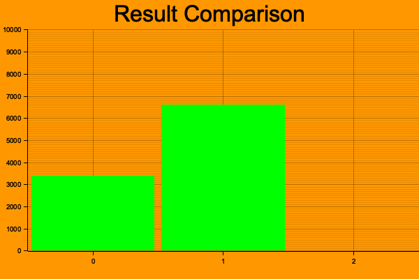

## Monty Hall Problem
The Monty Hall problem is a counter-intuitive statistics puzzle:

There are 3 doors, behind which are two goats and a car.
You pick a door (call it door A). You’re hoping for the car of course.
Monty Hall, the game show host, examines the other doors (B & C) and opens one with a goat. (If both doors have goats, he picks randomly.)
Here’s the game: Do you stick with door A (original guess) or switch to the unopened door? Does it matter?

Surprisingly, the odds aren’t 50-50. If you switch doors you’ll win 2/3 of the time!

## Simulation
If you are not familiar with Monty Hall problem, please read the docs below: 
1. https://en.wikipedia.org/wiki/Monty_Hall_problem

In this simulation, I just ran the simulation in RUST and showed how change your initial selection can increase chance of winning. Here is the outcome: 

## Notes: 
* First bar graph when participant does not change his mind.

* Second bar graph shows when participant change his mind after showed a goat

* I have used a parameter to run the simulation 10000 times to validate the idea. 

## Run  Simulation
* Go to the root of the project
* Run: `cargo build && cargo run`